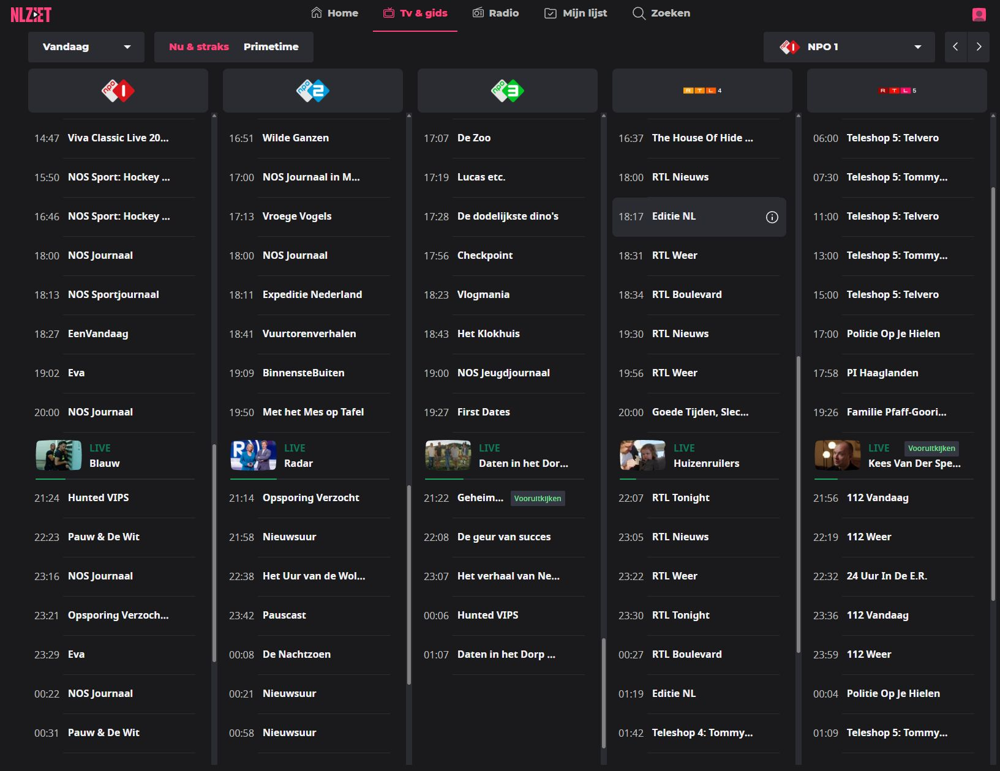

# Functioneel ontwerp - IPTV Electronic Program Guide

> Referentiebeeld: `guide.jpg`  
> Screenshot van NLZIET-achtige gidsweergave: `C:\Dropbox\Sources\tv\docs\guide.jpg`



## 1. Doel

De applicatie krijgt een snelle en overzichtelijke tv-gids waarin de gebruiker live IPTV-kanalen kan bekijken, huidige en komende programma's kan zien, programma-informatie kan openen en snel kan schakelen tussen zenders.

De gids moet aanvoelen als een moderne streaming-tv-gids: donker thema, duidelijke zenderkolommen, snelle navigatie, live-status, programma-informatie en directe playback via de bestaande Rust-player met `libmpv-2.dll`.

## 2. Scope

De eerste versie bevat:

- Overzicht van zenders en programma's
- Weergave van huidige en komende uitzendingen
- Direct starten van een kanaalstream
- Live kijken als kernfunctionaliteit
- Terugkijken als kernfunctionaliteit wanneer de IPTV-provider dit ondersteunt
- Programma's duidelijk markeren als live, terug te kijken of alleen informatief
- Markering van het live-programma
- Programma-informatie tonen
- Navigatie op datum en tijdsblok
- Filteren of wisselen van zendergroep
- Gebruik van IPTV-stream-URL's
- Gebruik van EPG-data uit XMLTV of vergelijkbare bron

Buiten scope voor de eerste versie:

- Gebruikersaccounts
- Cloud-sync
- Opnames
- Betalingen
- DRM
- Aanbevelingsalgoritmes

## 3. Referentiebeeld

De gewenste gidsweergave is gebaseerd op het aangeleverde voorbeeldbestand:

```text
C:\Dropbox\Sources\tv\docs\guide.jpg
```

In dit referentiebeeld is goed zichtbaar wat de gids prettig maakt:

- Meerdere zenders naast elkaar in verticale kolommen
- Donker thema met heldere witte tekst
- Zenderlogo bovenaan elke kolom
- Programma's onder elkaar per zender
- Begintijd links en titel rechts
- Huidig programma duidelijk gemarkeerd met `LIVE`
- Voortgangsbalk bij het live-programma
- Miniatuurafbeelding bij het live-programma
- Horizontaal bladeren door zenders
- Verticale scroll per zenderkolom
- Bovenaan filters zoals datum en tijdsblok
- Compact, snel en overzichtelijk

## 4. Hoofdscherm

Het hoofdscherm bestaat uit een donkere interface met bovenaan navigatie en daaronder een horizontaal scrollbare tv-gids.

### 4.1 Bovenste navigatie

Bovenaan staat een vaste navigatiebalk met:

- Home
- TV & gids
- Radio
- Mijn lijst
- Zoeken

De actieve sectie wordt visueel gemarkeerd.

Voor de eerste versie is alleen **TV & gids** verplicht functioneel. De overige items mogen als placeholder aanwezig zijn.

## 5. Gidsweergave

De gids toont meerdere zenders naast elkaar in kolommen.

Elke kolom bevat:

- Zenderlogo
- Programmalijst
- Begintijd per programma
- Programmatitel
- Live-indicator bij huidig programma
- Miniatuurafbeelding indien beschikbaar
- Voortgangsbalk van het huidige programma
- Optioneel label zoals `Vooruitkijken`, `Terugkijken` of `Catch-up`

Voorbeeldstructuur:

```text
+------------------+  +------------------+  +------------------+
| NPO 1            |  | NPO 2            |  | NPO 3            |
| logo             |  | logo             |  | logo             |
|------------------|  |------------------|  |------------------|
| 18:00 NOS Journaal| | 18:00 NOS Journaal| | 18:23 Vlogmania  |
| 18:13 Sportjournaal| |18:11 Programma   | | 18:43 Klokhuis   |
| LIVE Programma   |  | LIVE Programma   |  | LIVE Programma   |
| 21:24 Volgend    |  | 21:14 Volgend    |  | 21:22 Volgend    |
+------------------+  +------------------+  +------------------+
```

## 6. Datum- en tijdselectie

Boven de gids staan knoppen om de weergave te bepalen.

### 6.1 Datum

De gebruiker kan kiezen uit:

- Vandaag
- Morgen
- Gisteren
- Specifieke datum via datumkiezer

In de eerste versie is minimaal `Vandaag` verplicht.

### 6.2 Tijdblok

De gebruiker kan kiezen uit:

- Nu & straks
- Primetime

Later uitbreidbaar met:

- Ochtend
- Middag
- Avond
- Nacht
- Volledige dag

### 6.3 Gedrag `Nu & straks`

Bij `Nu & straks` scrolt elke zenderkolom automatisch naar het programma dat nu live is.

Het live-programma wordt visueel gemarkeerd.

### 6.4 Gedrag `Primetime`

Bij `Primetime` start de lijst rond 20:00 uur.

Dit is handig voor avondplanning.

## 7. Zendernavigatie

De gids toont meerdere zenders tegelijk. De gebruiker kan horizontaal door zenders bladeren.

Functionaliteit:

- Horizontaal scrollen met muis, touchpad of toetsenbord
- Knoppen links/rechts om naar vorige of volgende set zenders te gaan
- Zendergroepselectie, bijvoorbeeld:
  - Alle zenders
  - Favorieten
  - Nederlands
  - Sport
  - Nieuws
  - Radio
  - Eigen IPTV-lijst

## 8. Programma-item

Een programma-item bevat minimaal:

| Veld | Omschrijving |
|---|---|
| Starttijd | Tijd waarop het programma begint |
| Titel | Naam van het programma |
| Eindtijd | Nodig voor duur en voortgang |
| Beschrijving | Korte omschrijving, zichtbaar in detailvenster |
| Zender | Bijbehorende zender |
| Thumbnail | Optioneel plaatje |
| Live-status | Of het programma nu bezig is |
| Catch-up-status | Of terugkijken mogelijk is |
| Future-status | Of vooruitkijken of inplannen mogelijk is |
| Playback-type | `live`, `catchup`, `future`, `none` |
| Catch-up URL | Afgeleide of directe URL om programma terug te kijken |
| Catch-up vanaf begin | Of het huidige programma vanaf begin kan worden gestart |

## 9. Live-programma

Het live-programma krijgt extra nadruk:

- Label `LIVE`
- Miniatuurafbeelding indien beschikbaar
- Groene of opvallende voortgangsbalk
- Andere achtergrondkleur
- Klik op het live-programma start direct de stream

De voortgang wordt berekend op basis van:

```text
voortgang = (huidige tijd - starttijd) / (eindtijd - starttijd)
```

## 9.1 Terugkijken en EPG-markeringen

Terugkijken is geen bijzaak, maar een belangrijke functie van de gids. De EPG moet direct zichtbaar maken welke programma's live zijn, welke programma's terug te kijken zijn en welke programma's alleen als gidsinformatie beschikbaar zijn.

Elk programma krijgt daarom een duidelijke status:

| Status | Betekenis | Visuele weergave | Actie |
|---|---|---|---|
| `live` | Programma is nu bezig | Label `LIVE`, voortgangsbalk, thumbnail | Start live stream |
| `live_startover` | Programma is nu bezig en kan vanaf begin worden bekeken | Label `LIVE` + `Vanaf begin` | Kies tussen live of vanaf begin |
| `catchup` | Programma is afgelopen en terug te kijken | Label `Terugkijken` | Start catch-up stream |
| `future` | Programma moet nog beginnen | Normale weergave of label `Straks` | Toon info, eventueel herinnering |
| `unavailable` | Geen afspeelbare stream beschikbaar | Gedimde weergave | Alleen programma-info |

### 9.2 Visuele herkenbaarheid

De gebruiker moet in één oogopslag kunnen zien wat afspeelbaar is.

Regels:

- Huidig programma krijgt altijd een `LIVE`-label.
- Afgelopen programma's die terug te kijken zijn krijgen een `Terugkijken`-label.
- Huidige programma's die vanaf begin gestart kunnen worden krijgen een extra `Vanaf begin`-actie.
- Programma's zonder afspeelmogelijkheid worden minder nadrukkelijk getoond.
- Bij hover of selectie worden de beschikbare acties getoond.

Voorbeeld:

```text
18:00  NOS Journaal              Terugkijken
18:13  NOS Sportjournaal         Terugkijken
20:00  Radar                     LIVE   Vanaf begin
21:14  Opsporing Verzocht        Straks
```

### 9.3 Catch-up afhankelijk van provider

Niet elke IPTV-lijst ondersteunt terugkijken. De applicatie moet daarom per kanaal en per programma bepalen of catch-up mogelijk is.

Mogelijke bronnen voor catch-up:

- M3U-attributen zoals `catchup`, `catchup-source`, `timeshift` of provider-specifieke velden
- XMLTV start- en eindtijden in combinatie met een catch-up URL-template
- Handmatige kanaalconfiguratie door de gebruiker
- Provider API, indien beschikbaar

Als catch-up niet betrouwbaar bepaald kan worden, mag de applicatie geen terugkijkknop tonen. Liever eerlijk geen knop dan een knop die vaak faalt.

## 10. Programma-detailvenster

Bij klikken op een programma opent een detailvenster of zijpaneel.

Dit venster toont:

- Titel
- Zender
- Starttijd
- Eindtijd
- Duur
- Beschrijving
- Afbeelding
- Actieknoppen

Mogelijke actieknoppen:

- Kijk live
- Kijk vanaf begin, indien het huidige programma start-over ondersteunt
- Kijk terug, indien het programma afgelopen is en catch-up beschikbaar is
- Voeg toe aan mijn lijst
- Markeer als favoriet of interessant
- Toon meer afleveringen
- Sluit

Voor de serieuze eerste versie zijn **Kijk live**, **Kijk vanaf begin** en **Kijk terug** onderdeel van het ontwerp. De knoppen worden alleen getoond wanneer de technische bron dit ondersteunt.

## 11. Afspelen

Wanneer de gebruiker op een live-programma of zender klikt:

1. De applicatie zoekt de stream-URL bij de zender.
2. De bestaande Rust-player wordt aangeroepen.
3. `libmpv-2.dll` start de stream.
4. De gekozen zender wordt als actief gemarkeerd.
5. De EPG blijft beschikbaar als overlay of apart scherm.

## 12. Player-integratie

De EPG is niet zelf de videoplayer, maar stuurt de player aan.

Functioneel gedrag:

- Selecteer zender
- Geef stream-URL door aan player
- Toon huidige zendernaam
- Toon huidig programma
- Maak zappen mogelijk zonder de volledige applicatie te herladen

Voorbeeldacties:

```text
play_channel(channel_id)
play_program_live(channel_id)
play_program_from_start(program_id)
play_program_catchup(program_id)
stop_playback()
switch_channel(channel_id)
show_epg_overlay()
hide_epg_overlay()
```

Bij live kijken gebruikt de player de normale stream-URL van het kanaal. Bij terugkijken gebruikt de player een catch-up URL die wordt afgeleid uit kanaalconfiguratie, EPG-tijden en providerinformatie.

## 13. Databronnen

De gids gebruikt twee hoofdbronnen.

### 13.1 IPTV-kanalenlijst

Bijvoorbeeld M3U/M3U8.

Benodigde velden:

| Veld | Omschrijving |
|---|---|
| channel_id | Interne unieke ID |
| name | Zendernaam |
| logo_url | Logo |
| stream_url | IPTV-stream |
| group | Zendergroep |
| tvg_id | Koppeling met EPG-data |

### 13.2 EPG-data

Bij voorkeur XMLTV.

Benodigde velden:

| Veld | Omschrijving |
|---|---|
| tvg_id | Koppeling met kanaal |
| title | Programmatitel |
| subtitle | Optionele subtitel |
| description | Omschrijving |
| start_time | Starttijd |
| end_time | Eindtijd |
| category | Genre |
| icon | Programma-afbeelding |

## 14. Matching tussen IPTV en EPG

De applicatie koppelt IPTV-kanalen aan EPG-data via:

1. Exacte match op `tvg-id`
2. Match op genormaliseerde zendernaam
3. Handmatige mapping door gebruiker

Voorbeeld:

```text
IPTV kanaal: NPO 1 HD
tvg-id: npo1.nl

EPG kanaal:
id: npo1.nl
display-name: NPO 1
```

## 15. Performance-eisen

De gids moet snel aanvoelen.

Functionele eisen:

- Gids opent binnen 1 seconde met gecachte data
- Scrollen blijft vloeiend
- Alleen zichtbare zenders en programma's worden gerenderd
- EPG-data wordt lokaal gecachet
- Nieuwe EPG-data wordt op de achtergrond opgehaald
- Player mag niet haperen door EPG-updates

Aanbevolen aanpak:

- Lazy loading van programma-items
- Virtual scrolling per zenderkolom
- EPG-index op kanaal en tijd
- Lokale cache in SQLite, JSON of bincode
- UI-thread niet blokkeren bij parsing

## 16. Navigatie met toetsenbord

Voor desktopgebruik moet de gids goed met toetsenbord werken.

Minimale ondersteuning:

| Toets | Actie |
|---|---|
| Pijl links/rechts | Andere zender |
| Pijl omhoog/omlaag | Ander programma |
| Enter | Open detail of speel af |
| Escape | Sluit detailvenster |
| PageUp/PageDown | Scroll sneller door zenders |
| Home | Ga naar eerste zender |
| Ctrl+F | Zoeken |

## 17. Zoekfunctie

De gebruiker kan zoeken op:

- Programmatitel
- Zendernaam
- Genre
- Omschrijving

Zoekresultaten tonen:

- Titel
- Zender
- Starttijd
- Datum
- Actie om direct naar het programma in de gids te springen

Voor eerste versie mag zoeken beperkt zijn tot titel en zendernaam.

## 18. Favorieten

De gebruiker kan zenders als favoriet markeren.

Functionaliteit:

- Zender toevoegen aan favorieten
- Zender verwijderen uit favorieten
- Filter `Favorieten` tonen
- Favorieten bovenaan tonen

Opslag lokaal.

## 19. Visueel ontwerp

De interface gebruikt:

- Donker thema
- Duidelijke zenderkaarten
- Hoog contrast tussen tekst en achtergrond
- Programmatitels vet
- Tijden lichter en kleiner
- Actieve selectie duidelijk zichtbaar
- Live-programma met extra markering
- Logo's bovenaan elke kolom
- Subtiele scheidingslijnen tussen programma's

Belangrijk: de gids moet compact zijn, maar niet druk.

## 20. Foutafhandeling

### 20.1 Geen EPG-data

Wanneer voor een zender geen EPG-data beschikbaar is:

```text
Geen gidsinformatie beschikbaar
```

De gebruiker kan de zender alsnog live starten.

### 20.2 Stream werkt niet

Wanneer een stream niet start:

```text
Deze stream kan momenteel niet worden afgespeeld.
Controleer de URL of probeer later opnieuw.
```

Technisch wordt de fout van `libmpv` gelogd.

### 20.3 EPG-download mislukt

Wanneer EPG-data niet kan worden opgehaald:

- Gebruik laatst bekende cache
- Toon subtiele melding
- Probeer later opnieuw

## 21. Instellingen

Instellingen voor de gids:

- Standaard zendergroep
- Startweergave: `Nu & straks` of `Primetime`
- Automatisch EPG verversen
- Tijdzone
- Logo's tonen of verbergen
- Compacte modus
- Favorieten eerst tonen

## 22. Niet-functionele eisen

- Snel opstarten
- Lage CPU-belasting
- Geen haperingen tijdens afspelen
- Offline bruikbaar met gecachte EPG
- Geschikt voor muis, toetsenbord en eventueel afstandsbediening
- Geschikt voor Windows als eerste platform
- Later uitbreidbaar naar Linux

## 23. Mogelijke technische componenten

Mogelijke opbouw:

```text
Rust core
  - IPTV parser
  - XMLTV parser
  - EPG cache
  - Channel matcher
  - Catch-up capability detector
  - Catch-up URL builder
  - Playback controller
  - Settings manager

UI layer
  - EPG screen
  - Channel columns
  - Program cards
  - Search
  - Detail panel

Player layer
  - libmpv-2.dll
  - Stream lifecycle
  - Error handling
```

## 24. Minimale eerste serieuze versie

De eerste versie moet niet alleen een lijstje zenders tonen, maar meteen de basis leggen voor een echt bruikbare tv-gids.

De minimale serieuze versie bestaat uit:

1. M3U IPTV-lijst inlezen
2. XMLTV EPG inlezen
3. Kanalen koppelen via `tvg-id`
4. Zenderkolommen tonen zoals in `guide.jpg`
5. Programma's van vandaag tonen
6. Live-programma markeren
7. Klik op live-programma start de live stream
8. Aangeven welke afgelopen programma's terug te kijken zijn
9. Klik op terugkijkbaar programma start de catch-up stream
10. Bij huidig programma eventueel `Vanaf begin` tonen
11. Programma-detail tonen
12. Lokale cache gebruiken
13. Favorieten ondersteunen
14. Foutmelding tonen als een stream of catch-up URL niet werkt

Terugkijken mag technisch afhankelijk zijn van de provider, maar functioneel hoort het vanaf het begin in het ontwerp te zitten.

## 25. Later uitbreiden

Mogelijke uitbreidingen:

- Opnames plannen
- Mini-player naast de gids
- Picture-in-picture
- Afstandsbedieningmodus
- Automatische logo-download
- EPG-bronnen beheren
- Meerdere IPTV-profielen
- Import/export instellingen
- Programmaherinneringen
- Kijkgeschiedenis
- Slimme aanbevelingen

## 26. Kernadvies

Bouw eerst niet de mooie tv-gids, maar de onderliggende snelle zender-tijd-index.

De applicatie moet intern snel antwoord kunnen geven op vragen zoals:

```text
Geef mij per kanaal:
- het huidige programma
- de volgende 10 programma's
- alle programma's vanaf 20:00
- programma's tussen tijd X en Y
```

Als deze datastructuur goed is, kan de NLZIET-achtige interface daar netjes bovenop worden gebouwd.

De kern is dus:

```text
kanaalmapping + EPG-index + snelle rendering + directe mpv-playback
```
